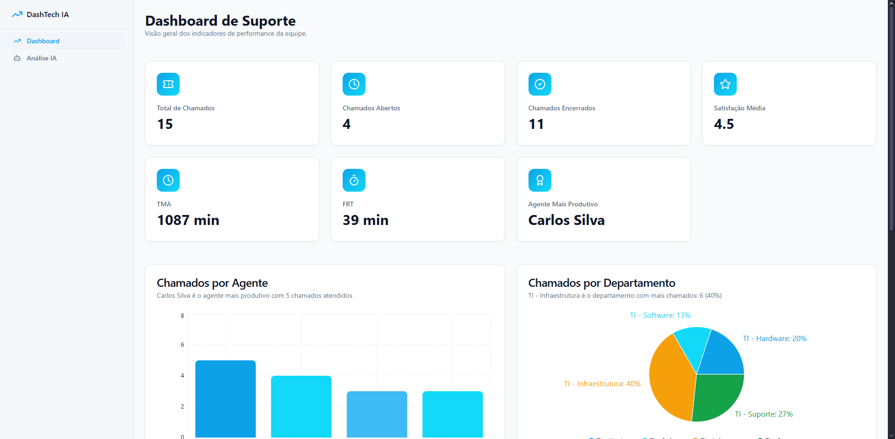

# Dynadash - Dashboard de Suporte Inteligente

O **Dynadash** é um dashboard interativo desenvolvido para a monitorização e análise de indicadores de desempenho (KPIs) de equipas de suporte. O projeto utiliza tecnologias web modernas e integra Inteligência Artificial (Google Gemini) para sugerir visualizações de dados dinâmicas.



## 🚀 Funcionalidades

- **Visão Geral de KPIs**: Visualização rápida de métricas essenciais como:
  - Total de Chamados, Chamados Abertos e Encerrados.
  - Satisfação Média dos utilizadores.
  - TMA (Tempo Médio de Atendimento) e FRT (Tempo de Primeira Resposta).
  - Identificação do Agente Mais Produtivo.
- **Visualização de Dados**:
  - Gráficos de desempenho por técnico.
  - Distribuição de chamados por categoria.
  - Tabela detalhada de tickets.
- **Integração com IA (Gemini)**:
  - O sistema utiliza a API do Google Gemini (`gemini-2.5-pro`) para analisar cabeçalhos de dados e sugerir automaticamente os tipos de gráficos mais adequados (Barras, Circular ou Linhas).
- **Interface Moderna**: Construída com componentes **shadcn/ui** para uma experiência de utilizador limpa e responsiva.

## 🛠️ Tecnologias Utilizadas

Este projeto foi construído com as seguintes ferramentas e bibliotecas:

- **Core**: [React](https://react.dev/), [TypeScript](https://www.typescriptlang.org/), [Vite](https://vitejs.dev/)
- **Estilos**: [Tailwind CSS](https://tailwindcss.com/)
- **Componentes UI**: [shadcn/ui](https://ui.shadcn.com/) (baseado em Radix UI)
- **Gráficos**: [Recharts](https://recharts.org/)
- **IA Generativa**: [Google Generative AI SDK](https://www.npmjs.com/package/@google/generative-ai)
- **Gestão de Estado/Dados**: [TanStack Query](https://tanstack.com/query/latest)
- **Ícones**: [Lucide React](https://lucide.dev/)

## ⚙️ Pré-requisitos

Antes de começar, certifique-se de que tem instalado:

- [Node.js](https://nodejs.org/) (versão 18 ou superior recomendada)
- npm, pnpm ou bun

## 📦 Instalação e Configuração

1. **Clonar o repositório**

```bash
git clone https://github.com/GuilhermeRoesler/Dynadash
cd dynadash
```

2. **Instalar dependências**

```bash
npm install
# ou
pnpm install
```

3. **Configurar Variáveis de Ambiente**
   O projeto requer uma chave de API do Google Gemini para as funcionalidades de IA.
   Crie um ficheiro `.env.local` na raiz do projeto e adicione a sua chave:

```env
VITE_GEMINI_API_KEY=a_sua_chave_api_aqui
```

> **Nota**: Pode obter uma chave de API no [Google AI Studio](https://aistudio.google.com/).

4. **Executar o projeto**
   Inicie o servidor de desenvolvimento:

```bash
npm run dev
```

Aceda a `http://localhost:8080` (ou a porta indicada no terminal) para visualizar a aplicação.

## 📜 Scripts Disponíveis

- `npm run dev`: Inicia o servidor de desenvolvimento.
- `npm run build`: Cria a versão de produção da aplicação.
- `npm run preview`: Pré-visualiza a versão de produção localmente.
- `npm run lint`: Executa o ESLint para verificar a qualidade do código.

## 🤝 Contribuição

Contribuições são bem-vindas! Sinta-se à vontade para abrir _issues_ ou enviar _pull requests_ para melhorias ou correções.

1. Faça um Fork do projeto
2. Crie a sua Feature Branch (`git checkout -b feature/NovaFuncionalidade`)
3. Faça o Commit das suas mudanças (`git commit -m 'Adiciona NovaFuncionalidade'`)
4. Faça o Push para a Branch (`git push origin feature/NovaFuncionalidade`)
5. Abra um Pull Request
